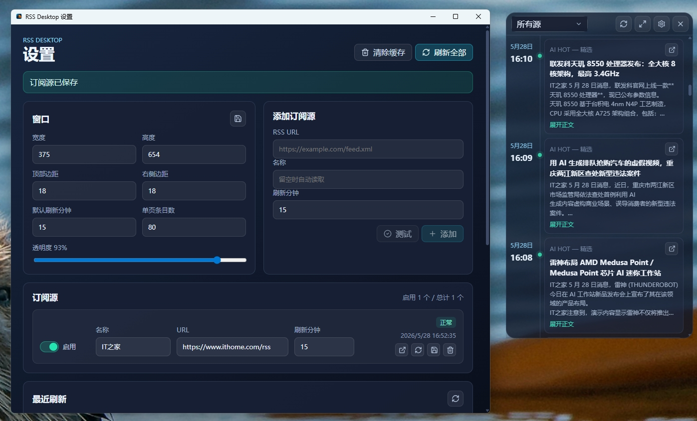

# RSS Desktop Widget

RSS Desktop Widget 是一个基于 Tauri v2 的轻量桌面 RSS 小组件，支持 Windows 和 macOS。它以半透明悬浮窗口呈现订阅内容，并提供本地订阅管理、后台刷新、阅读状态和系统托盘/菜单栏入口。



## Features

- 桌面常驻 RSS 时间线，适合放在屏幕边缘持续浏览。
- 自定义 RSS / Atom / JSON Feed 订阅源，支持启用、停用、测试和删除。
- 本地 SQLite 持久化，订阅源、条目、阅读状态、收藏状态和刷新日志均保存在本机。
- 后台定时刷新和手动刷新，按 feed 去重并限制单次拉取大小。
- 可调整窗口尺寸、位置、透明度、刷新间隔、单页条目数和自动滚动速度。
- Windows 系统托盘和 macOS 菜单栏入口，可快速显示窗口、打开设置、刷新或退出。
- 跨平台安装包自动构建：Windows x64、macOS Apple Silicon、macOS Intel。

## Platform Support

| Platform | Build Target | Release Asset |
| --- | --- | --- |
| Windows x64 | `x86_64-pc-windows-msvc` | `.exe`, `.msi`, portable `.zip` |
| macOS Apple Silicon | `aarch64-apple-darwin` | `.dmg` |
| macOS Intel | `x86_64-apple-darwin` | `.dmg` |

macOS 发布包目前未接入 Apple Developer ID 签名和公证。首次打开时，如果遇到 Gatekeeper 提示，请参考下方 Troubleshooting。

## Download

前往 [GitHub Releases](https://github.com/jer0y/RSS-Desktop/releases) 下载最新版本。

- Windows 用户优先下载 `RSS-Desktop-<version>-x64-setup.exe`。
- Apple Silicon Mac 下载 `RSS-Desktop-<version>-macos-arm64.dmg`。
- Intel Mac 下载 `RSS-Desktop-<version>-macos-x64.dmg`。

## Tech Stack

- Desktop: Tauri v2
- Frontend: React, TypeScript, Vite
- Backend: Rust
- Database: SQLite via `rusqlite`
- Feed parsing: `feed-rs`
- HTTP: `reqwest` with native TLS

## Development

### Requirements

- Node.js 20+
- npm 10+
- Rust stable 1.77.2+
- Windows: Microsoft Edge WebView2 Runtime, Visual Studio Build Tools with MSVC
- macOS: Xcode Command Line Tools

### Install

```bash
npm install
```

### Run

```bash
npm run tauri:dev
```

仅预览前端：

```bash
npm run dev
```

### Test

```bash
npm run build
npm run check:rust
npm run test:rust
```

## Build

默认构建当前平台：

```bash
npm run tauri:build
```

构建 macOS Apple Silicon：

```bash
npm run tauri:build -- --target aarch64-apple-darwin
```

构建 macOS Intel：

```bash
npm run tauri:build -- --target x86_64-apple-darwin
```

构建产物位于：

```text
src-tauri/target/<target>/release/bundle/
```

## Release

版本发布由 GitHub Actions 自动完成。推送 `v*.*.*` tag 后，`.github/workflows/release.yml` 会在 Windows x64、macOS arm64、macOS x64 上构建并上传 Release assets。

```bash
git tag v0.2.6
git push origin v0.2.6
```

## Troubleshooting

### macOS 提示“应用已损坏，无法打开”

由于 macOS 的安全机制，非 App Store 下载的应用可能会触发此提示。当前开源发布流程尚未接入 Apple Developer ID 签名和公证，因此部分系统版本会显示更严格的 Gatekeeper 提示。

确认应用来自本项目的 GitHub Release 后，可以使用以下方式处理：

1. 命令行修复（推荐）

   ```bash
   sudo xattr -rd com.apple.quarantine "/Applications/RSS Desktop Widget.app"
   ```

   如果安装路径或应用名称不同，请相应调整命令中的路径。

2. 系统设置放行

   打开“系统设置” -> “隐私与安全性”，在安全提示区域点击“仍要打开”。

### macOS 菜单栏图标不可见

菜单栏图标过多时，系统可能会隐藏部分图标。请尝试关闭其他菜单栏应用，或在更宽的显示器上查看。

### Windows 托盘图标不可见

Windows 可能会将图标折叠到任务栏右下角的隐藏图标区域。点击展开箭头后，可以将图标拖到任务栏可见区域。

## Design Notes

- RSS 数据只保存在本机，不提供账号系统或云同步。
- 应用只解析 feed 中自带的 `content` / `description`，不会额外抓取原文网页。
- 刷新任务默认顺序执行，避免多个订阅源同时拉取造成资源峰值。

## License

This project is licensed under the terms of the [LICENSE](LICENSE).
